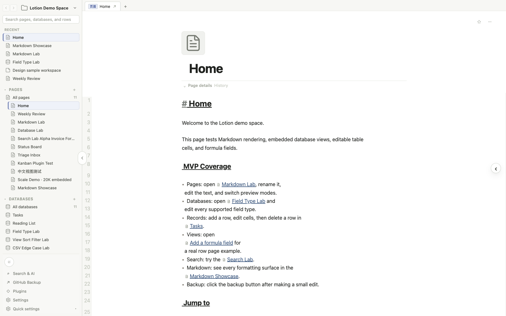
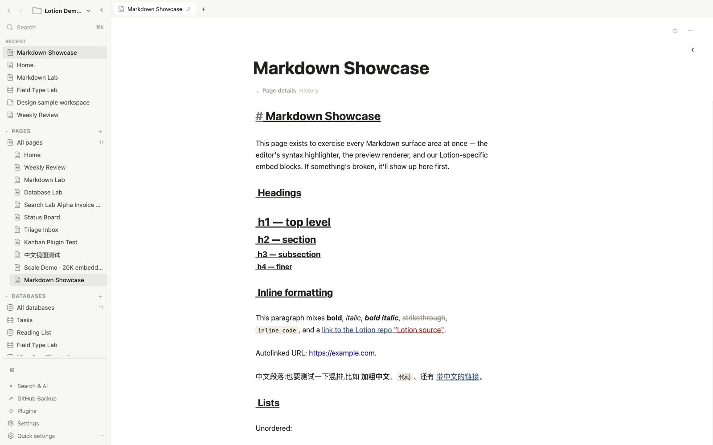
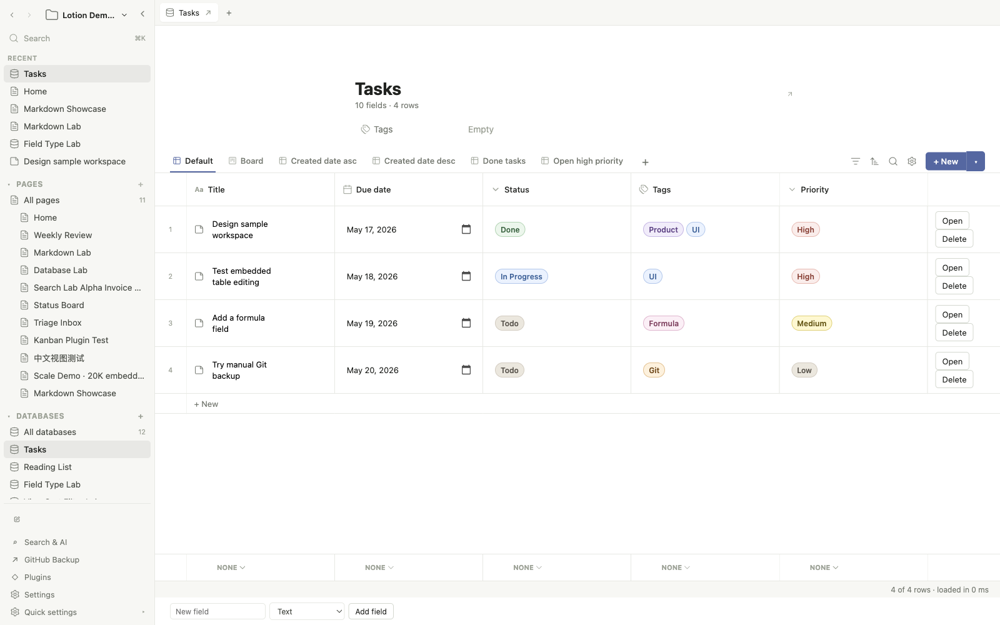
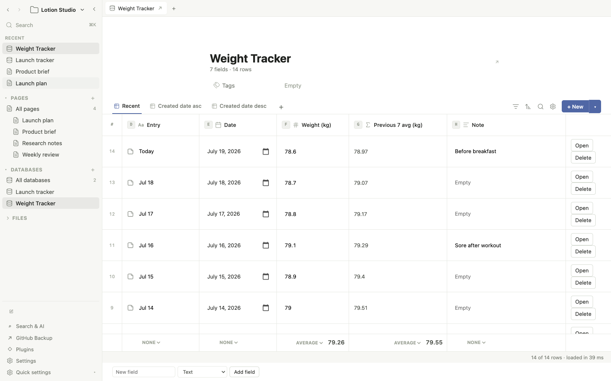
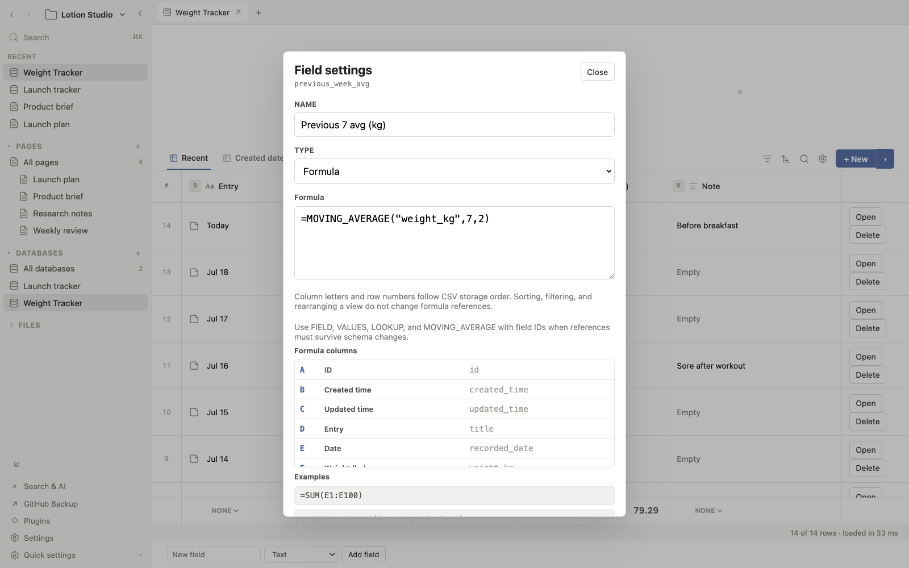

<div align="center">

<picture>
  <source media="(prefers-color-scheme: dark)" srcset="design/lotion-logo-inverse.svg">
  
</picture>

# Lotion

### A local-first knowledge workspace with Notion-like editing and files you can keep.

Pages live in Markdown. Database rows live in CSV. Attachments stay as regular
files. Lotion provides the interface without taking ownership of the data.

[Website](https://hu-xianglong.github.io/lotion/) ·
[Documentation](docs/user-requirements.md) ·
[Report an issue](https://github.com/hu-xianglong/lotion/issues)


</div>



## Why Lotion

Most workspace applications make the application database the only practical
way to read your knowledge. Lotion takes a different approach: the interface is
rich, but the underlying workspace remains transparent and portable.

- **Local-first.** Workspaces live on your computer by default.
- **Plain-text-first.** Page bodies use Markdown and database rows use CSV.
- **Interface-first.** Normal use does not require editing raw files.
- **Git-friendly.** Files can be inspected, diffed, backed up, and restored with
  standard Git tooling.
- **LLM-friendly.** The workspace and public API are structured for search,
  automation, and assistant workflows.
- **Extensible.** Plugins can provide commands, views, search providers, backup
  providers, LLM integrations, and UI surfaces.

Lotion is built for people who want a Notion-like working environment without
giving up Obsidian-like ownership of their data.

## What Works Today

### Pages and editing

- Markdown pages with a live, syntax-aware editing experience.
- Slash commands for headings, lists, tasks, toggles, callouts, code, tables,
  images, links, equations, embedded pages, and embedded database views.
- Inline formatting, highlights, block formatting, Vim mode, and raw-source
  editing when needed.
- Nested pages, tabs, favorites, recent pages, backlinks, page history, and
  workspace-wide navigation.

### Databases

- Editable rows, columns, and row pages.
- Text, number, select, multi-select, date, checkbox, URL, formula, relation,
  rollup, and entity-reference fields.
- Spreadsheet formulas with `A1` references, ranges, `VLOOKUP`, `SUMIF`,
  `SUMPRODUCT`, and stable `FIELD`, `VALUES`, and `LOOKUP` references.
- Table, board, calendar, list, and gallery views.
- Sorting, filtering, visible-field configuration, column ordering, summaries,
  templates, and embedded live views.
- Virtualized rendering and latency gates for large CSV-backed datasets.

### Search, import, backup, and extensions

- Fast search across pages, databases, rows, references, tags, and commands.
- Optional advanced search and LLM integrations through built-in plugins.
- Notion HTML and CSV import with nested pages, databases, attachments, source
  references, audit reports, and regression coverage for lossy exports.
- Local Git backup and GitHub backup surfaces.
- A typed plugin API and a stable customer API for automation and integrations.

## Workspace Format

The UI hides implementation details during normal use, but the files remain
available when you need them.

```text
my-space/
├── lotion.json
├── attachments/
│   ├── images/
│   └── documents/
└── databases/
    ├── system/
    │   └── pages--db_pages/
    │       ├── data.csv
    │       └── pages/*.md
    └── user/
        └── Tasks--db_tasks/
            ├── schema.json
            ├── data.csv
            ├── views/*.json
            └── pages/*.md
```

- Markdown stores page and row-page bodies.
- CSV stores page metadata and database records.
- JSON stores workspace, schema, and view configuration.
- Attachments remain ordinary files inside the workspace.

There is no required database server and no proprietary content store.

## Product Tour

### Write with a friendly Markdown editor

Lotion renders formatting while keeping the source portable. You can use slash
commands and familiar editing controls, then inspect or edit the underlying
Markdown whenever you need to.



### Work with structured data

Database views are references over the same CSV-backed records. Changing a
record or view is reflected everywhere that view appears.



### Use spreadsheet formulas across database rows

Notion-style formulas are centered on the current record and require relations
or rollups to aggregate other records. Lotion can also treat the underlying CSV
as a spreadsheet: formulas can address cells, ranges, and arbitrary source rows
directly.

This weight tracker stores one measurement per day. An Excel-style formula
calculates the average of the available measurements in the previous seven
calendar days:

```text
=IFERROR(ROUND(AVERAGEIFS([weight_kg], [recorded_date], ">="&[@recorded_date]-7, [recorded_date], "<"&[@recorded_date]), 2), "")
```

- `[weight_kg]` is the complete CSV column to average.
- `[recorded_date]` is the complete date column.
- `[@recorded_date]` is the date in the current row.
- The two criteria select the previous seven calendar days and exclude today.
- `ROUND(..., 2)` keeps two decimal places; `IFERROR(..., "")` leaves the first entry empty.
- `A1`, `SUM(E1:E100)`, `VLOOKUP`, `SUMIF`, and other Excel-style expressions
  remain available when positional formulas are the better fit.

Sorting, filtering, rearranging a view, or inserting a backdated record does not
change the date window. Positional `A1` formulas still use the displayed source
coordinates when that model is the better fit.





## Getting Started

Lotion is currently source-first and intended for developers and early
adopters. Node.js 20 or newer and npm are recommended.

```sh
git clone https://github.com/hu-xianglong/lotion.git
cd lotion
npm install
npm run demo:reset
npm run dev
```

`npm run dev` starts Vite, the Electron main-process compiler, and the desktop
application. The included demo workspace contains synthetic pages, databases,
views, and scale fixtures.

To create a production build:

```sh
npm run build
npm start
```

## Import from Notion

For the best migration fidelity, export the same Notion workspace twice. The
two exports complement each other:

- **Markdown & CSV** supplies database schemas, properties, rows, and portable
  Markdown pages.
- **HTML** supplies richer page blocks, colors, callouts, icons, covers, and
  embedded views.

### 1. Export your Notion workspace

1. Open Notion on desktop or the web, then go to **Settings → General**.
2. Select **Export all workspace content**.
3. Choose **Markdown & CSV**, start the export, and download the ZIP when
   Notion sends the link.
4. Repeat the export and choose **HTML**.
5. Unzip the two downloads into separate folders. Do not combine or rearrange
   their contents.

See [Notion's workspace export guide](https://www.notion.com/help/back-up-your-data)
if the export option is unavailable or the workspace is split into several
`Export-…` archives.

### 2. Import both exports into Lotion

1. Start Lotion and choose **Import from Notion…** from the workspace menu. You
   can also open **Plugins → Notion Import** from an existing workspace.
2. For **Markdown & CSV export**, choose the extracted Markdown export folder.
3. For **HTML export**, choose the extracted HTML export folder. Selecting only
   one export is supported, but selecting both gives the best result.
4. Select **Review selected exports** and check the detected page, database,
   row, and attachment counts.
5. Select **Choose target & import…**, then choose a new empty folder for the
   Lotion workspace. The currently open workspace is not modified.
6. When the import finishes, review the generated **Import report** and
   **Import review** database for skipped, duplicate, or ambiguous items.

Lotion matches the two exports using stable Notion IDs. Same-name pages and
databases do not overwrite each other. With the default audit option enabled,
the original export is also retained under `attachments/original/` inside the
new workspace.

## Quality Gates

The default test lane covers the file-service boundary, public APIs, Notion
import, formulas, slash commands, editor policies, renderer components,
workspace integrity, links, hierarchy, fixture consistency, and latency budgets.

```sh
npm test
npm run typecheck
npm run build
```

Focused lanes are available for UI regressions and performance work:

```sh
npm run test:ui-regression
npm run test:production-visual
npm run test:startup-latency
npm run test:search-latency
```

Install the tracked hooks with `npm run hooks:install`; the pre-commit hook runs
`npm run gate:commit`. Production-shaped verification uses
`npm run release:gate`, which runs the full regression and visual lanes, builds
an isolated app snapshot, cold-starts it, verifies build hashes, and checks the
complete Electron preload API contract. GitHub runs the same release gate for
pull requests and pushes to `main`.

The 500K-row stress CSV is generated locally because it exceeds GitHub's file
size limit:

```sh
node scripts/generate-stress-fixtures.mjs
```

See [Testing](docs/testing.md) for the complete test matrix.

## Architecture

Lotion separates desktop privileges from UI code:

```text
React renderer
    │ typed contextBridge API
Electron preload
    │ validated IPC
Electron main process
    ├── workspace and file services
    ├── import and search services
    ├── Git and attachment services
    └── plugin host
```

The renderer never reads local files directly. Main-process services validate
workspace-relative paths and own durable writes. This keeps the local-first
model testable without coupling integrations to React or Electron UI details.

For automation, `lotion/customer-api` exposes versioned workspace, page,
database, view, row-page, attachment, search, entity, and Notion import
operations. See the [Customer API](docs/customer-api.md).

## Project Status

Lotion is in early development. It is useful for hands-on testing, but the UI,
workspace format, and plugin experience are still evolving. Keep backups of
important workspaces and review generated changes before adopting them into an
existing knowledge base.

Current priorities include:

- editor fidelity and Notion import compatibility;
- responsive desktop and future mobile shells;
- faster startup and large-workspace navigation;
- stronger Git backup and sync workflows;
- a documented third-party plugin development path.

The active backlog lives in [`tasks/todo`](tasks/todo), and completed work is
recorded in [`tasks/done`](tasks/done).

## Documentation

| Document | Purpose |
| --- | --- |
| [User requirements](docs/user-requirements.md) | Product vision and user-facing concepts |
| [Frontend design system](docs/frontend-design-system.md) | UI rules, tokens, and regression expectations |
| [Code design](docs/code-design.md) | Process boundaries and workspace architecture |
| [Customer API](docs/customer-api.md) | Stable automation and integration surface |
| [Notion compatibility](docs/notion-import-compat.md) | Supported import behavior and limitations |
| [Testing](docs/testing.md) | Test lanes, fixtures, and performance gates |
| [Roadmap](docs/roadmap.md) | Performance findings and architectural follow-ups |

## Contributing

Issues, focused pull requests, fixture improvements, and import edge cases are
welcome. Before opening a pull request:

1. Keep the change scoped to one behavior or product surface.
2. Add regression coverage proportional to the risk.
3. Run `npm test`, `npm run typecheck`, `npm run test:coverage`, and `npm run build`.
   The coverage gate requires 90% lines independently for main/shared,
   bundled plugins, and the Renderer core; visible interactions additionally
   require the multi-viewport UI regression artifacts.
4. Include UI artifacts when changing visible behavior.
5. Do not include personal workspaces, credentials, or proprietary exports.

Use [GitHub Issues](https://github.com/hu-xianglong/lotion/issues) for bugs and
proposals.

## License

Lotion is available under the [MIT License](LICENSE).
